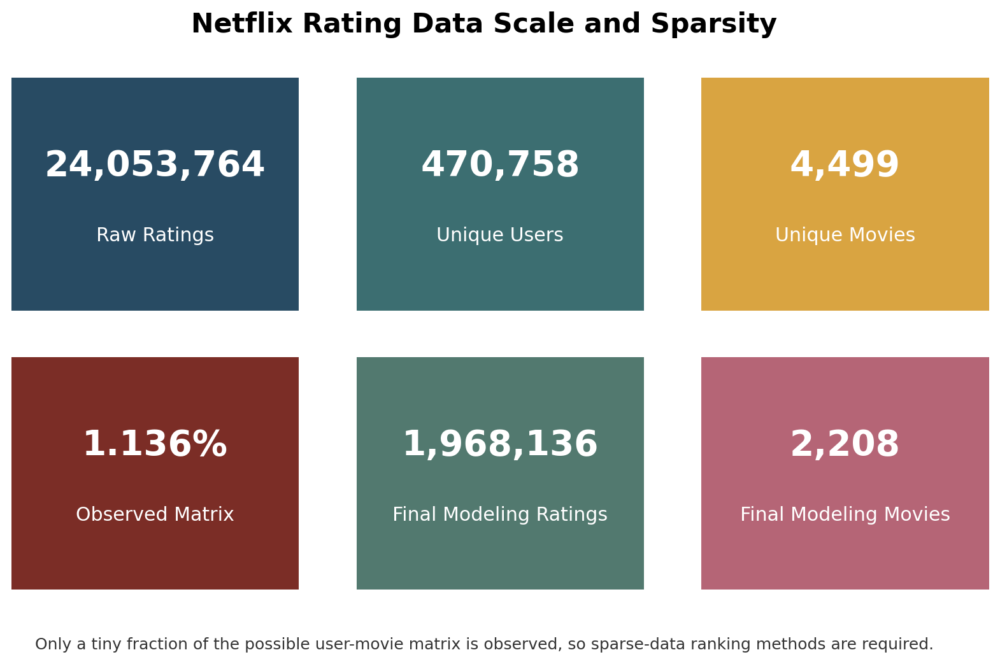
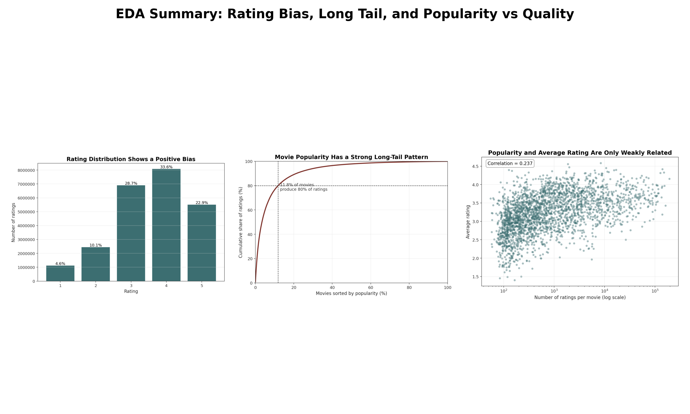
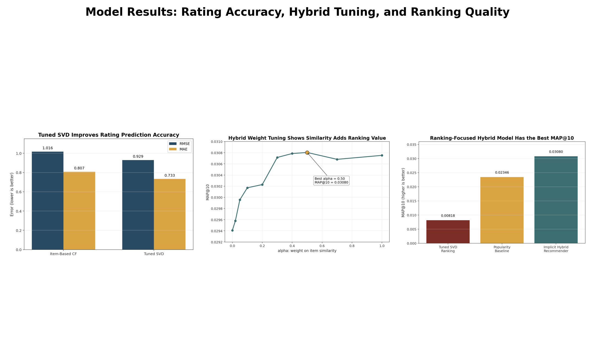

# Movie Recommendation System: Technical Report

## 1. Problem Understanding

This project builds a Netflix movie recommendation system from user-movie rating data. The system has two goals:

- Predict how a user may rate an unseen movie.
- Generate a ranked top-k list of unseen movies for each user.

The final user-facing task is ranking, so the project evaluates both rating-prediction accuracy and top-k recommendation quality. The full workflow is in `main.ipynb`; reproducible scripts are provided for preprocessing, training, evaluation, recommendation generation, and report figures.

## 2. Data and Preprocessing

The project uses Netflix ratings and movie metadata.

| File | Purpose |
|---|---|
| `combined_data_1.txt` | Raw Netflix ratings in movie-header format |
| `netflix_ratings_1.csv` | Parsed ratings with `UserID`, `MovieID`, `Rating`, and `Date` |
| `movie_titles.csv` | Movie metadata with `MovieID`, `Year`, and `Title` |

Preprocessing steps:

1. Parse the raw Netflix file if the parsed CSV is not already present.
2. Load movie metadata using Latin-1 encoding to handle title characters.
3. Sample 3,000,000 ratings with `random_state=42` for reproducibility.
4. Keep users with at least 10 ratings to reduce user sparsity.
5. Keep movies with at least 50 ratings to ensure enough item-level signal.
6. Use `UserID`, `MovieID`, and `Rating` for modeling.
7. Create an 80:20 train/test split.

Final modeling dataset after filtering:

| Quantity | Value |
|---|---:|
| Ratings | 1,968,136 |
| Users | 100,209 |
| Movies | 2,208 |
| Training ratings | 1,574,508 |
| Test ratings | 393,628 |



*Figure 1. The raw data is large, but the user-movie matrix is still highly sparse. This justifies filtering and collaborative ranking methods.*

## 3. Exploratory Data Analysis

EDA examined rating behavior, user activity, movie popularity, sparsity, temporal patterns, and popularity versus average rating.

Key findings:

- Ratings are positively biased, with most ratings concentrated around 3 and 4 stars.
- User behavior is imbalanced: many users rate only a small number of movies, while a smaller group is highly active.
- Movie popularity is strongly long-tailed: a small set of movies receives most ratings.
- Popularity and quality are not equivalent. The popularity-vs-average-rating correlation is weak, around `0.187`.
- Because the matrix is sparse and popularity is imbalanced, a personalized recommender is more appropriate than a popularity-only list.



*Figure 2. EDA summary: ratings are positively biased, movie popularity is long-tailed, and popularity has only weak relationship with average rating.*

## 4. Methodology and Model Design

The methodology follows a complete recommendation workflow: preprocess and filter sparse Netflix ratings, explore user/item behavior, train rating-prediction models, build a ranking-focused hybrid recommender, evaluate using held-out data, and generate top-k recommendations.

### 4.1 Item-Based Collaborative Filtering

This model builds a movie-user rating matrix, fills missing values with zero for cosine similarity, and predicts ratings from the user's ratings on similar movies.

Neighborhood size `K` was tuned using `K = 5, 10, 20, 30, 50, 100`. The best value was `K = 20`, with RMSE approximately `1.0163` and MAE `0.8075`.

This approach is interpretable and directly models movie similarity, but it is limited by sparse rating overlap.

### 4.2 SVD Matrix Factorization

The SVD model from Surprise learns latent user and item factors, capturing hidden preference patterns beyond direct item overlap.

Selected hyperparameters:

| Parameter | Value |
|---|---:|
| `n_factors` | 20 |
| `n_epochs` | 20 |
| `reg_all` | 0.05 |
| `lr_all` | 0.005 |
| `random_state` | 42 |

Final SVD rating-prediction result: RMSE `0.9294`, MAE `0.7332`.

### 4.3 Implicit Item-Based Hybrid Recommender

Strong rating prediction did not automatically produce the best top-k ranking, so the final recommender was designed directly for ranking.

The hybrid model treats ratings of 4 or 5 as positive interactions and scores unseen movies using:

```text
final_score = alpha * item_similarity_score + (1 - alpha) * popularity_score
```

Signals used:

- Popularity score: promotes movies liked by many users.
- Item-similarity score: promotes movies similar to the user's liked movies.
- Rated-movie filtering: removes movies already rated by the user.

The hybrid weight `alpha` was tuned using MAP@10. The best result was `alpha = 0.50` with MAP@10 approximately `0.03080`, showing that both popularity and item similarity contributed useful ranking signal.

## 5. Evaluation Metrics and Experimental Results

The project uses rating and ranking metrics because prediction accuracy and recommendation quality are different objectives.

| Metric | Purpose | Better Direction |
|---|---|---|
| RMSE | Penalizes large numeric rating errors | Lower |
| MAE | Measures average absolute rating error | Lower |
| Precision@10 | Share of top-10 recommendations that are relevant | Higher |
| Recall@10 | Share of held-out relevant movies recovered in top 10 | Higher |
| Hit Rate@10 | Share of users with at least one top-10 hit | Higher |
| MAP@10 | Rewards relevant movies appearing higher in the ranking | Higher |

For ranking evaluation, movies rated 4 or 5 in the test set are treated as relevant.

Experimental results:

| Model | RMSE | MAE | MAP@10 | Main Conclusion |
|---|---:|---:|---:|---|
| Item-Based CF | 1.0163 | 0.8075 | - | Interpretable baseline, weaker under sparsity |
| Tuned SVD | 0.9294 | 0.7332 | 0.00818 | Best rating prediction, weak ranking |
| Popularity Baseline | - | - | 0.02346 | Strong non-personalized ranking baseline |
| Implicit Hybrid | - | - | 0.03080 | Best final top-k recommender |

Final hybrid quality: Precision@10 `0.02160`, Recall@10 `0.09582`, Hit Rate@10 `0.19767`, MAP@10 `0.03080`.

Practical model comparison:

| Model | Recommendation Quality | Training Complexity | Computational Efficiency | Practical Usability |
|---|---|---|---|---|
| Item-Based CF | Moderate; sparse overlap hurts | Medium | Fast after similarity build; memory grows with movies | Interpretable baseline |
| Tuned SVD | Best RMSE, weak ranking | Medium-high | Efficient after training | Good for rating prediction |
| Popularity Baseline | Strong but generic | Low | Very fast | Robust, not personalized |
| Implicit Hybrid | Best MAP@10 | Medium | Efficient top-k scoring on sampled set | Best balance of personalization, popularity, explainability |



*Figure 3. Model results summary: SVD is best for rating prediction, while the implicit hybrid recommender is best for top-k ranking. Hybrid tuning selects `alpha = 0.50`.*

## 6. Recommendation Examples

`recommendation_generation.py` finds a user's rated movies, scores unseen candidates, removes already-rated movies, sorts by hybrid score, and returns top-k titles with release years.

Example recommendations for user `305344`:

| Rank | Movie | Year | Hybrid Score |
|---:|---|---:|---:|
| 1 | The Sixth Sense | 1999 | 0.9843 |
| 2 | The Silence of the Lambs | 1991 | 0.9715 |
| 3 | Pirates of the Caribbean: The Curse of the Black Pearl | 2003 | 0.9436 |
| 4 | Lord of the Rings: The Fellowship of the Ring | 2001 | 0.9397 |
| 5 | Braveheart | 1995 | 0.9280 |
| 6 | Lethal Weapon | 1987 | 0.9169 |
| 7 | Finding Nemo (Widescreen) | 2003 | 0.9085 |
| 8 | Jaws | 1975 | 0.9080 |
| 9 | Shrek 2 | 2004 | 0.8979 |
| 10 | The Wizard of Oz: Collector's Edition | 1939 | 0.8885 |

The full top-10 list demonstrates readable user-facing output. Already-rated movies are removed before ranking.

## 7. Success and Failure Cases

A success case is a user for whom at least one held-out positive test movie appears in the top-10 recommendations. The notebook generated recommendations for sampled evaluation users and compared them against held-out positive test movies.

Representative success cases:

| UserID | Hits@10 | AP@10 | Matched held-out positive movies |
|---:|---:|---:|---|
| 84748 | 3 | 0.3778 | Lord of the Rings: The Fellowship of the Ring; Pirates of the Caribbean: The Curse of the Black Pearl; X2: X-Men United |
| 373913 | 3 | 0.3417 | American Beauty; Pirates of the Caribbean: The Curse of the Black Pearl; Reservoir Dogs |
| 253991 | 3 | 0.2667 | Finding Nemo (Widescreen); The Silence of the Lambs; Shrek 2 |

These cases confirm that the model can recover movies users actually liked but that were hidden during training. MAP@10 remains modest because the task is sparse and each user has few held-out positive movies.

Failure cases and causes:

| Failure Case | Likely Cause | Improvement |
|---|---|---|
| No held-out hit in top 10 | Sparse user history or few positive test movies | Train on more data; add content features |
| Popular movies dominate recommendations | Long-tail imbalance and popularity signal | Add diversity/novelty constraints |
| Similarity misses niche taste | Limited overlap between niche movies | Use genre/cast/director metadata |

## 8. Reproducibility

| Step | Command |
|---|---|
| Install dependencies | `pip install -r requirements.txt` |
| Preprocess data | `python data_preprocessing.py --data-dir . --output-dir processed` |
| Train models | `python model_training.py --processed-dir processed --artifacts-dir artifacts` |
| Evaluate recommender | `python evaluation.py --processed-dir processed --artifacts-dir artifacts --top-k 10` |
| Generate recommendations | `python recommendation_generation.py --artifacts-dir artifacts --user-id 305344 --top-k 10` |
| Generate report figures | `python generate_report_figures.py` |

Generated directories:

| Directory | Contents |
|---|---|
| `processed/` | Processed data and train/test splits |
| `artifacts/` | Saved SVD model, hybrid recommender, metrics, and tuning results |
| `report_images/` | Figures used in this report |

## 9. Key Insights and Future Work

Key insights:

- The Netflix rating data is large but sparse, so filtering and sparse-aware models are necessary.
- Ratings are positively biased and movie popularity is long-tailed.
- Popularity is a useful signal but does not fully represent movie quality or user preference.
- Tuned SVD is best for numeric rating prediction.
- The implicit item-based hybrid recommender is best for top-k ranking.
- Rating-prediction accuracy and recommendation-ranking quality are different objectives.

Future improvements:

- Train on a larger sample or the full Netflix dataset to improve collaborative coverage.
- Add content features such as genre, cast, director, language, and synopsis.
- Use temporal train/test splitting to better simulate future recommendations.
- Add ranking metrics such as NDCG@10, coverage, diversity, and novelty.
- Save and deploy model artifacts behind a simple API or web interface.

## 10. Conclusion

This project implements a complete movie recommendation workflow: data parsing, preprocessing, EDA, model training, hyperparameter tuning, evaluation, recommendation generation, success-case analysis, and reproducible scripts.

The tuned SVD model achieved the best rating-prediction performance with RMSE `0.9294` and MAE `0.7332`. However, the final goal is ranked recommendation, and the implicit item-based hybrid recommender achieved the best top-k result with MAP@10 `0.03080` at `alpha = 0.50`. Therefore, the hybrid recommender was selected as the final recommendation model.
